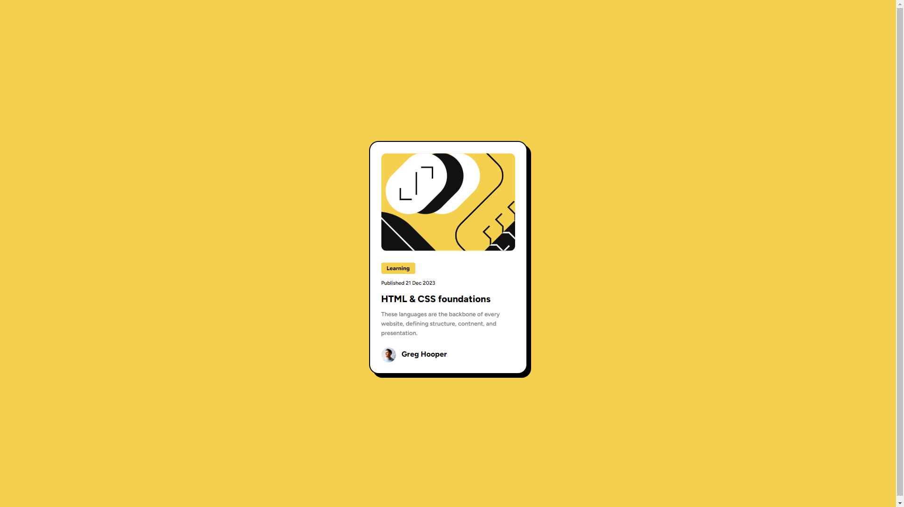

# Frontend Mentor - Blog-Card-Clone

This is a solution to the [Blog preview card challenge on Frontend Mentor](https://www.frontendmentor.io/challenges/blog-preview-card-ckPaj01IcS).

## Table of contents

- [Overview](#overview)
  - [The challenge](#the-challenge)
  - [Screenshot](#screenshot)
  - [Links](#links)
- [My process](#my-process)
  - [Built with](#built-with)
  - [What I learned](#what-i-learned)
  - [Continued development](#continued-development)
  - [Useful resources](#useful-resources)
- [Author](#author)
- [Acknowledgments](#acknowledgments)

## Overview

### The challenge

Users should be able to:

- See hover and focus states for all interactive elements on the page

### Screenshot

()

### Links

- Live Site URL: [https://paradawx.github.io/blog-card-clone/](https://paradawx.github.io/blog-card-clone/)

### Built with

HTML & CSS

### What I learned

I feel like I reinforced my knowledge and could do the majority of the card without much help from google.

Also had some troubles with git because i started the project and then tried to push to a new repo, rather than starting a new repo and cloning as a local copy.

had the most trouble getting the abstract svg dimensions perfect.

```css
.image {
  justify-content: center;
  display: flex;
  flex-direction: column;
  height: 13rem;
  width: 17.75rem;
  overflow: hidden;
  border-radius: 0.7rem;
  margin-bottom: 1.5rem;
}
```

## Author

- Frontend Mentor - [@dawsonjoyner](https://www.frontendmentor.io/profile/dawsonjoyner)

**Note: Delete this note and add/remove/edit lines above based on what links you'd like to share.**

## Acknowledgments

Thanks to Øystein Håberg for his advice on my last project, i feel like this one is structured better but i still have a long way to go.
